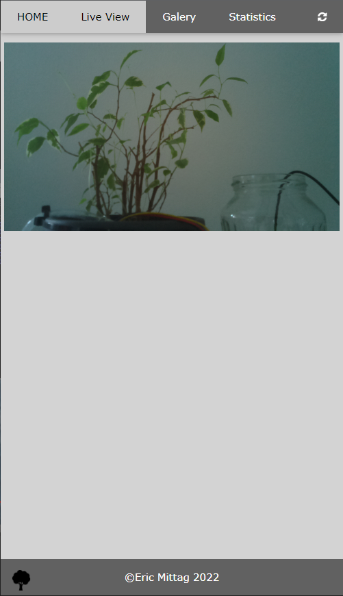

<!-- Improved compatibility of back to top link: See: https://github.com/othneildrew/Best-README-Template/pull/73 -->
<a name="readme-top"></a>
<!--
*** Thanks for checking out the Best-README-Template. If you have a suggestion
*** that would make this better, please fork the repo and create a pull request
*** or simply open an issue with the tag "enhancement".
*** Don't forget to give the project a star!
*** Thanks again! Now go create something AMAZING! :D
-->


<!-- PROJECT SHIELDS -->
<!--
*** I'm using markdown "reference style" links for readability.
*** Reference links are enclosed in brackets [ ] instead of parentheses ( ).
*** See the bottom of this document for the declaration of the reference variables
*** for contributors-url, forks-url, etc. This is an optional, concise syntax you may use.
*** https://www.markdownguide.org/basic-syntax/#reference-style-links
-->

<!-- PROJECT LOGO -->
<br />
<div align="center">
  <a href="https://github.com/EricMittag/plant_supervisor">
    
  </a>

<h3 align="center">Plant Supervisor</h3>

  <p align="center">
    Automated plant watering system on a raspberry pi with additional web page to monitor plant via a camera and get sensor data with statistics.
    <br />
    <a href="https://github.com/EricMittag/plant_supervisor"><strong>Explore the docs »</strong></a>
    <br />
    <br />
    <a href="https://github.com/EricMittag/plant_supervisor/issues">Report Bug</a>
    ·
    <a href="https://github.com/EricMittag/plant_supervisor/issues">Request Feature</a>
  </p>
</div>

<!-- ABOUT THE PROJECT -->
## About The Project

A supervisor to monitor a plant via the RPi Camera and water it depending on the soil moisture. It runs on a Raspberry Pi Zero and uses the RPi 

<p align="right">(<a href="#readme-top">back to top</a>)</p>


### Built With

* Raspberry Pi
* Python
* Flask
* Pandas
* Plotly

<p align="right">(<a href="#readme-top">back to top</a>)</p>


<!-- GETTING STARTED -->
## Getting Started

<center>
  
  

  
</center>

### Prerequisites


### Installation

1. Clone the repo
   ```sh
   git clone https://github.com/EricMittag/plant_supervisor.git
   ```
2. Built Hardware
3. Install packages
4. Run: .\run.sh

### Schematic / Used Pins
* TBD

<p align="right">(<a href="#readme-top">back to top</a>)</p>

<!-- USAGE EXAMPLES -->
## Usage





<p align="right">(<a href="#readme-top">back to top</a>)</p>


<!-- ROADMAP -->
## Roadmap


<p align="right">(<a href="#readme-top">back to top</a>)</p>


<!-- LICENSE -->
## License

Distributed under the MIT License.

<p align="right">(<a href="#readme-top">back to top</a>)</p>
